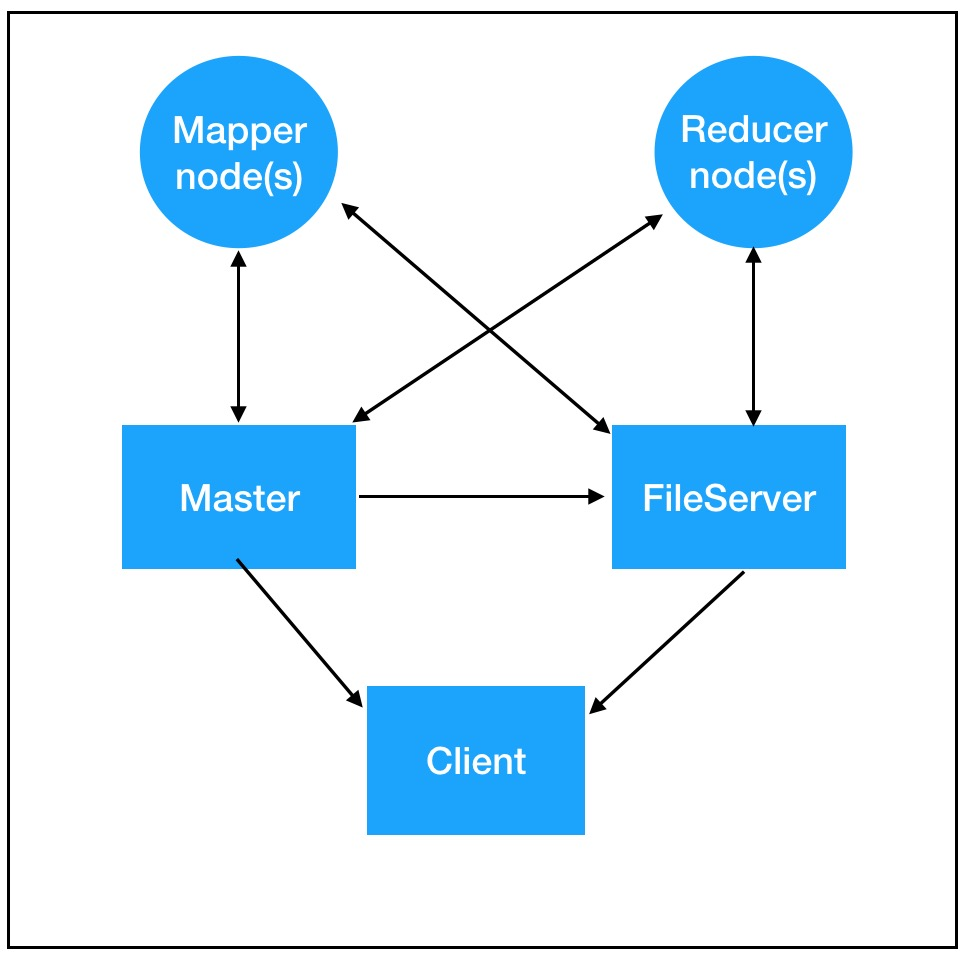
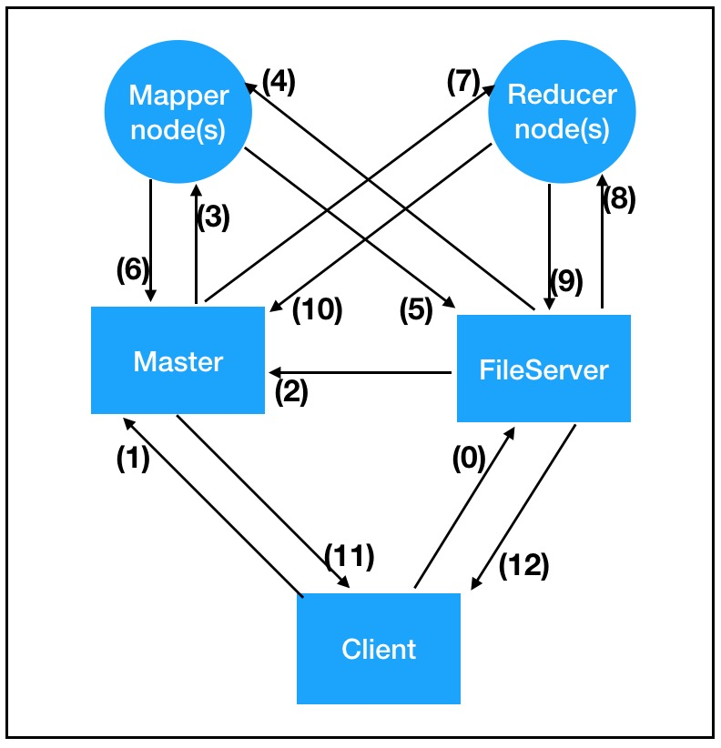

## Building the MapReduce framework
This project is a custom implementation of the Map Reduce framework. This framework is a programming model which facilitates performing parallel and distributed processing on huge data sets. Hadoop is the most popular implementation of Map Reduce. 

If your task was to count the frequency of each unique node in a file of 5GB using a single computer, how much time would it require? Map Reduce framework allows us to leverage the multiple computing nodes to accomplish much, MUCH faster. 

If you want to briefy understand the underlying concepts of this framework, you may go through [this](https://www.guru99.com/introduction-to-mapreduce.html) article.

## Demo videos

### Demo1: Running WordCount task on a simple file

[](http://www.youtube.com/watch?v=cBLWVu1wu-E "Demo1")

### Demo2: Demonstrating the Fault Tolerance feature

[](http://www.youtube.com/watch?v=mNZ8mWs5Cg0 "Demo2")


## Architecture

<!-- <center> -->

<!-- </center> -->

<!--  -->

<br>

## Sequence of operations



<!--  -->


(0) Client uploads input file(s) to FileServer <br>
(1) Client initiates task request to Master<br>
(2) Master accesses meta data of the input file from the FileServer<br>
(3) Master assigns chunks of input file(s) to Mapper Nodes<br>
(4) Mapper Node(s) download only the part(s) of input file(s) assigned to it<br>
(5) Mapper Nodes finish processing and upload their resulting files to FileServer<br>
(6) Mapper Node(s) inform Master that its task is done and the resulting files are uploaded to the FileServer<br>
(7) Master assigns tasks to Reducer Node(s)<br>
(8) Reducer Node(s) download files relevant to the assigned task<br>
(9) Reducer Node(s) uploads resulting file to FileServer<br>
(10) Reducer Node(s) inform master that task is done<br>
(At this point Master assigns the task of aggregating the resulting files of all Reducer Nodes to one Reducer Node)<br>
(11) Master informs the client that processing is done and the output file is present on the FileServer<br>
(12) Client downloads output file from the FileServer<br>


## How to run

```
make all
./fs_server
./master_server <master_IP> <log_file>
./mapper_node <master_IP> <mapper_IP>
./reducer_node <master_IP> <reducer_IP>
./dummy_client <master_IP>
```

Span as many mappers/reducers as needed. Two sample tasks are implemented, word count and inverted document index. The framework implementation can be tested as on these two tasks. The syntax for the same can be found in dummy_client.cpp file.

