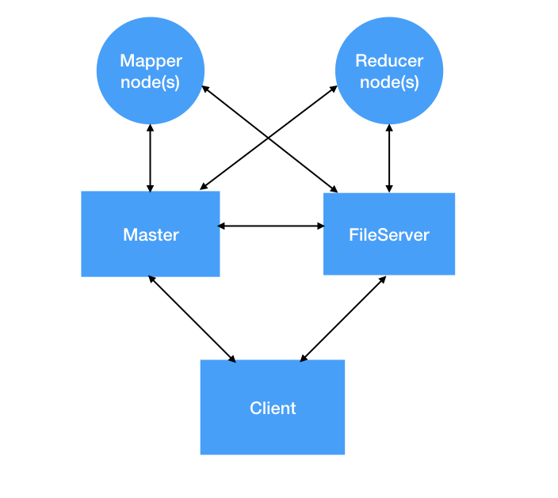

## Building the MapReduce framework
This project is a custom implementation of the Map Reduce framework. This framework is a programming model which facilitates performing parallel and distributed processing on huge data sets. Hadoop is the most popular implementation of Map Reduce. 

If your task was to count the frequency of each unique node in a file of 5GB using a single computer, how much time would it require? Map Reduce framework allows us to leverage the multiple computing nodes to accomplish much, MUCH faster. 

If you want to briefy understand the underlying concepts of this framework, you may go through [this](https://www.guru99.com/introduction-to-mapreduce.html) article.

## Demo videos

### Demo1: Running WordCount task on a simple file
[](https://youtu.be/cBLWVu1wu-E "Demo1")

### Demo2: Demonstrating the Fault Tolerance feature

[](https://youtu.be/mNZ8mWs5Cg0 "Demo2")

## High Level Design  




## How to run

```
make all
./fs_server
./master_server <master_IP> <log_file>
./mapper_node <master_IP> <mapper_IP>
./reducer_node <master_IP> <reducer_IP>
./dummy_client <master_IP>
```

Span as many mappers/reducers as needed. Two sample tasks are implemented, word count and inverted document index. The framework implementation can be tested as on these two tasks. The syntax for the same can be found in dummy_client.cpp file.

